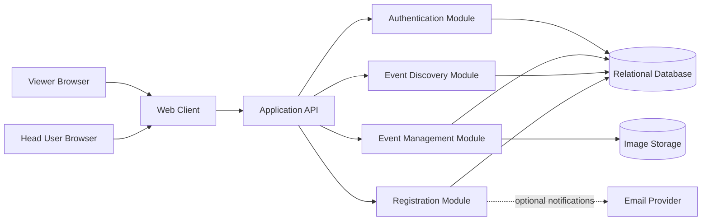
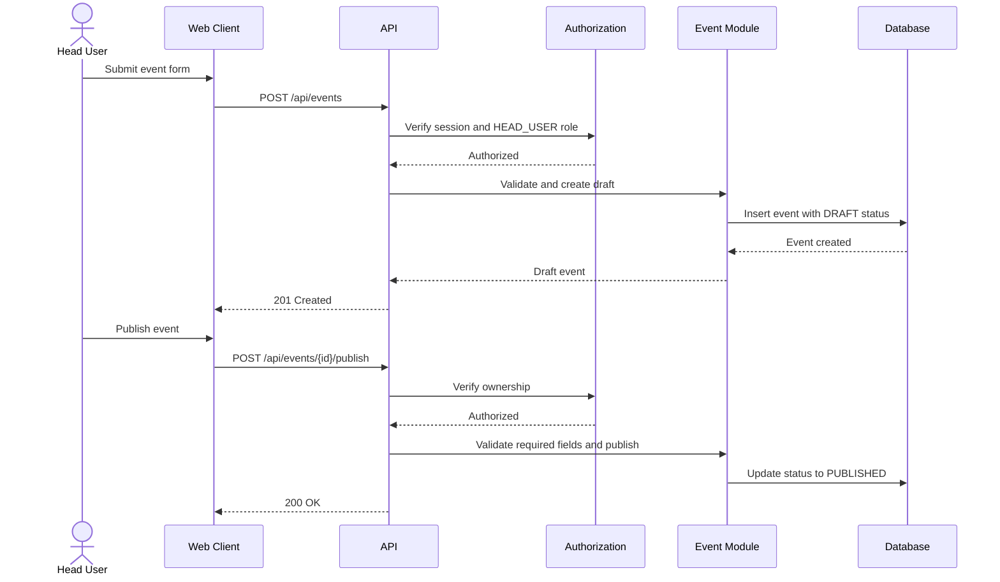
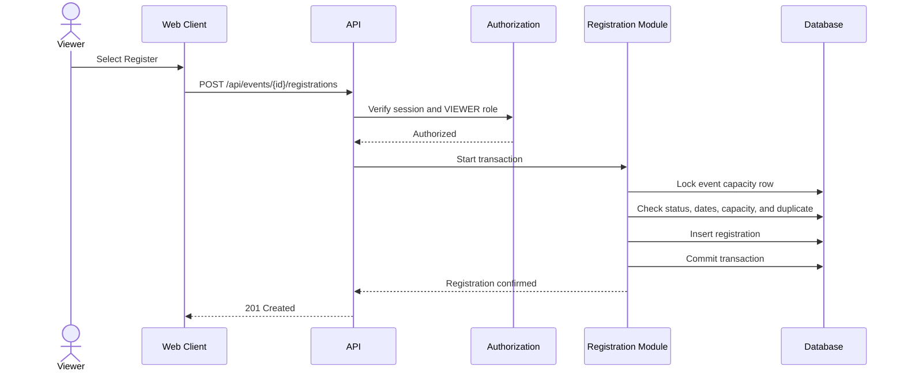
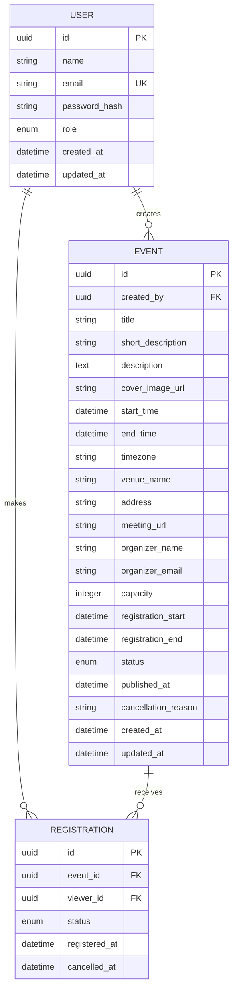
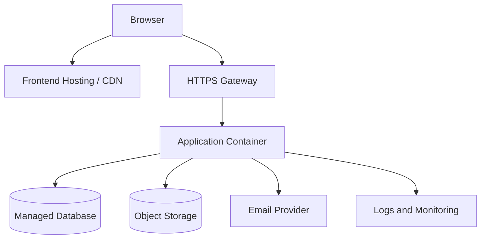

origin# Event Management System Architecture

## 1. Architecture Summary

The system will use a **three-layer modular monolith** for the MVP:

- **Presentation layer**: Responsive web client for Head Users and Viewers.
- **Application layer**: API endpoints, authentication, authorization, validation, and workflow orchestration.
- **Data layer**: Relational database for users, events, and registrations.

A modular monolith keeps the initial system easy to develop and deploy while maintaining clear boundaries between business areas. Individual modules can be extracted into services later if scale requires it.

## 2. High-Level System



## 3. Recommended Technology Shape

The architecture is technology-independent, but the MVP should use these categories:

- **Frontend**: Component-based web application with responsive layouts.
- **Backend**: REST API with a typed request and response contract.
- **Database**: PostgreSQL or another ACID-compliant relational database.
- **File storage**: Object storage for event cover images.
- **Authentication**: Secure cookie-based session or short-lived access token with refresh mechanism.
- **Email**: External provider for password reset and optional registration notifications.
- **Deployment**: Static frontend hosting, containerized API, managed database, and managed object storage.

## 4. Application Modules

### 4.1 Authentication and User Module

Responsibilities:

- Account registration and sign-in.
- Sign-out and password reset.
- Password hashing and credential verification.
- User profile management.
- Role assignment and role checks.

Rules:

- Roles are `HEAD_USER` and `VIEWER`.
- A user's role must be checked on the server for every protected operation.
- Passwords must never be stored in plain text.

### 4.2 Event Management Module

Responsibilities:

- Create and update events.
- Validate event fields.
- Manage event ownership.
- Publish, unpublish, cancel, and delete events.
- Upload and associate cover images.
- Provide Head User dashboard data.

Only the owning Head User may modify an event. Event status should be represented by a controlled enum:

- `DRAFT`
- `PUBLISHED`
- `UNPUBLISHED`
- `CANCELLED`

A new event always starts as `DRAFT`. Publishing requires all required fields to pass validation.

### 4.3 Event Discovery Module

Responsibilities:

- Return published upcoming events.
- Search by title and description keywords.
- Filter by date, location, and category when categories are enabled.
- Sort by event date or publication date.
- Return event detail data appropriate for Viewers.

This module must never expose drafts, unpublished events, or private management data through public endpoints.

### 4.4 Registration Module

Responsibilities:

- Register a Viewer for an event.
- Prevent duplicate active registrations.
- Enforce capacity safely under concurrent requests.
- Allow a Viewer to cancel their own registration.
- Provide attendee data to the owning Head User.
- Report whether an event is available, full, closed, or cancelled.

Capacity enforcement must happen inside a database transaction. Application-level checks alone are not sufficient because two requests can arrive at the same time.

### 4.5 Notification Module

This is optional for the MVP and can initially be an internal adapter. It may later send:

- Password reset messages.
- Registration confirmations.
- Event cancellation notices.
- Event reminders.

## 5. Request Flow

### Head User Creates and Publishes an Event



### Viewer Registers for an Event



## 6. API Design

All API responses should use consistent JSON structures and appropriate HTTP status codes.

### Authentication

| Method | Endpoint | Purpose |
|---|---|---|
| `POST` | `/api/auth/signup` | Create an account |
| `POST` | `/api/auth/signin` | Start an authenticated session |
| `POST` | `/api/auth/signout` | End the session |
| `POST` | `/api/auth/password-reset` | Request a password reset |
| `GET` | `/api/me` | Return the current user |
| `PATCH` | `/api/me` | Update the current profile |

### Public Event Discovery

| Method | Endpoint | Purpose |
|---|---|---|
| `GET` | `/api/events` | Search and list published events |
| `GET` | `/api/events/{id}` | View a published event |

Supported query parameters may include `search`, `date_from`, `date_to`, `location`, `sort`, `page`, and `page_size`.

### Head User Event Management

| Method | Endpoint | Purpose |
|---|---|---|
| `GET` | `/api/manage/events` | List events owned by the Head User |
| `POST` | `/api/events` | Create a draft event |
| `GET` | `/api/manage/events/{id}` | View a managed event |
| `PATCH` | `/api/events/{id}` | Edit an owned event |
| `POST` | `/api/events/{id}/publish` | Publish an event |
| `POST` | `/api/events/{id}/unpublish` | Unpublish an event |
| `POST` | `/api/events/{id}/cancel` | Cancel an event |
| `DELETE` | `/api/events/{id}` | Delete an owned draft |
| `GET` | `/api/events/{id}/attendees` | List attendees for an owned event |

### Viewer Registration

| Method | Endpoint | Purpose |
|---|---|---|
| `POST` | `/api/events/{id}/registrations` | Register the current Viewer |
| `GET` | `/api/me/registrations` | List the Viewer's registrations |
| `DELETE` | `/api/events/{id}/registrations/me` | Cancel the Viewer's registration |

## 7. Data Architecture

### Entity Relationship



### Database Constraints and Indexes

- Unique index on normalized `user.email`.
- Foreign key from `event.created_by` to `user.id`.
- Foreign keys from `registration.event_id` and `registration.viewer_id`.
- Unique constraint on `(event_id, viewer_id)` for the registration record.
- Check that `end_time` is after `start_time`.
- Check that `capacity` is greater than zero.
- Index published events by `status` and `start_time`.
- Index registrations by `event_id` and `viewer_id`.
- Store timestamps in UTC and retain the event timezone for display.

## 8. Authorization Model

Authorization is enforced in this order:

1. Authenticate the request.
2. Confirm the required role.
3. For event mutations, confirm that the authenticated Head User owns the event.
4. For registration mutations, confirm that the authenticated Viewer owns the registration.
5. Execute the operation only after all checks pass.

Expected authorization responses:

- `401 Unauthorized` when no valid session exists.
- `403 Forbidden` when the user has the wrong role or lacks ownership.
- `404 Not Found` when a resource should not be revealed to the requester.

## 9. Validation Rules

Event creation and publishing should validate:

- Title and description are present and within configured length limits.
- Start and end times are valid and ordered.
- Timezone is recognized.
- Capacity is a positive integer.
- Registration dates are ordered and compatible with the event date.
- Exactly one usable location is provided: physical address or online meeting link.
- Organizer contact information is valid.
- A cancelled event cannot be republished without an explicit product decision.

Registration should validate:

- The event is published.
- Registration is currently open.
- The event has not started or been cancelled.
- The Viewer has no active registration.
- Capacity remains available within the transaction.

## 10. Security and Privacy

- Use HTTPS in every deployed environment.
- Hash passwords with a current adaptive password-hashing algorithm.
- Use secure, HttpOnly, SameSite cookies when using sessions.
- Apply CSRF protection to cookie-authenticated state-changing requests.
- Validate and sanitize all incoming data on the server.
- Restrict image uploads by file type, size, and content validation.
- Rate-limit sign-in, password reset, and registration endpoints.
- Do not expose password hashes, private attendee contact details, or internal authorization data.
- Record security-relevant events such as failed sign-ins and unauthorized mutations.

## 11. Frontend Structure

The web client should be organized around role-specific route areas:

```text
src/
  app/
    routes/
      auth/
      events/
      manage/
      profile/
  components/
  features/
    auth/
    events/
    discovery/
    registrations/
  services/
    api-client
    session
  shared/
    forms
    validation
    accessibility
```

Important UI states include:

- Loading state.
- Empty search results.
- Draft, published, unpublished, full, and cancelled event states.
- Form validation errors.
- Unauthorized and forbidden responses.
- Registration success and failure states.
- Offline or temporary network failure state.

## 12. Deployment Architecture



For production:

- Run the API behind HTTPS and a gateway or load balancer.
- Use environment variables or a secrets manager for credentials.
- Keep the database private to the application network.
- Enable automated backups and test database restoration.
- Store uploaded images outside the application container.
- Centralize application logs and monitor API errors, latency, and database health.

## 13. Testing Strategy

### Unit Tests

- Event field validation.
- Role and ownership authorization.
- Event status transitions.
- Registration eligibility checks.
- Timezone and registration-window handling.

### Integration Tests

- Authentication flows.
- Event creation and publishing.
- Public filtering and visibility rules.
- Registration capacity and duplicate prevention.
- Concurrent registration attempts.
- Cancellation and unpublishing behavior.

### End-to-End Tests

- Head User creates and publishes an event.
- Viewer finds and registers for an event.
- Viewer cancels a registration.
- Head User cancels an event.
- Viewer cannot access management pages or APIs.

### Accessibility and Performance

- Keyboard navigation and form labels.
- Color contrast and status messaging.
- Mobile and desktop layouts.
- API response time for event listing and details.
- Pagination for events and attendee lists.

## 14. Observability and Operations

Track:

- Sign-in success and failure rates.
- Event creation, publication, cancellation, and deletion counts.
- Registration success, rejection, and cancellation counts.
- API latency and error rates.
- Database connection and query performance.
- Storage upload failures.

Use correlation IDs in API logs so a user action can be followed across application and database operations. Avoid logging passwords, session tokens, or unnecessary personal data.

## 15. Delivery Phases

### Phase 1: MVP Foundation

- Project setup and deployment pipeline.
- Database migrations.
- Authentication and roles.
- User profile basics.

### Phase 2: Event Management

- Head User dashboard.
- Event draft creation and editing.
- Publishing, unpublishing, cancellation, and ownership checks.
- Cover image storage.

### Phase 3: Viewer Experience

- Public event listing.
- Search, filtering, sorting, and event details.
- Responsive and accessible layouts.

### Phase 4: Registration

- Registration transaction and capacity enforcement.
- Viewer registration history and cancellation.
- Head User attendee list.

### Phase 5: Hardening

- Security review.
- Automated integration and end-to-end tests.
- Monitoring, backups, rate limits, and performance testing.

## 16. Architectural Decisions and Tradeoffs

- **Modular monolith first**: Lower operational complexity and faster MVP delivery than microservices.
- **Relational database**: Strong constraints and transactions are important for event ownership and capacity enforcement.
- **REST API**: Simple integration between the web client and backend, with clear resource-oriented endpoints.
- **Object storage for images**: Keeps large files out of the database and application container.
- **UTC storage plus event timezone**: Prevents ambiguity while preserving correct local display.
- **Database transaction for registration**: Protects capacity and duplicate-registration rules under concurrency.
