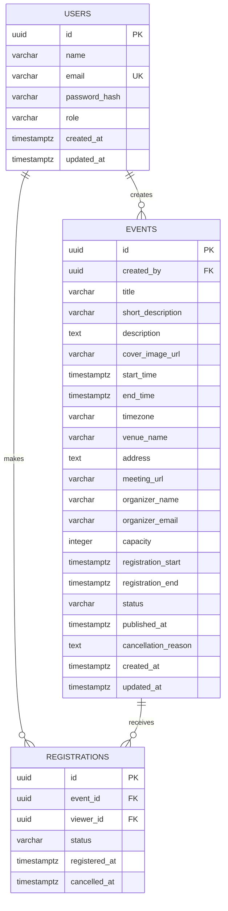

# Event Management System Database

## 1. Database Purpose

The database stores users, events, and Viewer registrations for the Event Management System. It must support:

- Two roles: `HEAD_USER` and `VIEWER`.
- Head User ownership of events.
- Event drafts and publication states.
- Public discovery of published events only.
- Viewer registrations and cancellations.
- Capacity enforcement under concurrent requests.
- Reliable date and timezone handling.
- Secure storage of account and attendee information.

## 2. Recommended Database

Use a relational database such as PostgreSQL because the system requires:

- Foreign key relationships.
- Unique constraints.
- Transactions.
- Row-level locking.
- Strong consistency for registration capacity.
- Indexed filtering and sorting for event discovery.

The application should access the database through repositories or a trusted ORM with parameterized queries. Database schema changes must be managed through versioned migrations.

## 3. Entity Relationship



## 4. Enumerations

Use database enums or constrained text values, depending on the migration strategy.

### User Roles

- `HEAD_USER`
- `VIEWER`

### Event Statuses

- `DRAFT`
- `PUBLISHED`
- `UNPUBLISHED`
- `CANCELLED`

### Registration Statuses

- `ACTIVE`
- `CANCELLED`

Only the backend service should change these values. The database constraints provide a final integrity check.

## 5. Tables

### 5.1 `users`

Stores login identity, profile information, and role.

| Column | Type | Rules |
|---|---|---|
| `id` | UUID | Primary key, generated by the application or database |
| `name` | VARCHAR(120) | Required |
| `email` | VARCHAR(320) | Required, normalized, unique |
| `password_hash` | VARCHAR(255) | Required, never plain text |
| `role` | VARCHAR(20) | Required, `HEAD_USER` or `VIEWER` |
| `created_at` | TIMESTAMPTZ | Required, UTC |
| `updated_at` | TIMESTAMPTZ | Required, UTC |

Recommended constraints:

- `name` must not be empty after trimming.
- `email` must be normalized to lowercase before storage.
- `role` must be one of the supported roles.
- `password_hash` must not be exposed through API responses.

### 5.2 `events`

Stores event content, ownership, scheduling, location, registration settings, and lifecycle status.

| Column | Type | Rules |
|---|---|---|
| `id` | UUID | Primary key |
| `created_by` | UUID | Required foreign key to `users.id` |
| `title` | VARCHAR(200) | Required |
| `short_description` | VARCHAR(500) | Optional |
| `description` | TEXT | Required |
| `cover_image_url` | VARCHAR(2048) | Optional |
| `start_time` | TIMESTAMPTZ | Required, UTC |
| `end_time` | TIMESTAMPTZ | Required, UTC and after start |
| `timezone` | VARCHAR(64) | Required IANA timezone |
| `venue_name` | VARCHAR(200) | Required for physical events |
| `address` | TEXT | Required for physical events |
| `meeting_url` | VARCHAR(2048) | Required for online events |
| `organizer_name` | VARCHAR(120) | Required |
| `organizer_email` | VARCHAR(320) | Required, valid email |
| `capacity` | INTEGER | Required, greater than zero |
| `registration_start` | TIMESTAMPTZ | Optional, UTC |
| `registration_end` | TIMESTAMPTZ | Optional, UTC |
| `status` | VARCHAR(20) | Required event status |
| `published_at` | TIMESTAMPTZ | Set when first published |
| `cancellation_reason` | TEXT | Required when cancelled |
| `created_at` | TIMESTAMPTZ | Required, UTC |
| `updated_at` | TIMESTAMPTZ | Required, UTC |

### 5.3 `registrations`

Stores a Viewer's registration relationship with an event.

| Column | Type | Rules |
|---|---|---|
| `id` | UUID | Primary key |
| `event_id` | UUID | Required foreign key to `events.id` |
| `viewer_id` | UUID | Required foreign key to `users.id` |
| `status` | VARCHAR(20) | Required, `ACTIVE` or `CANCELLED` |
| `registered_at` | TIMESTAMPTZ | Required, UTC |
| `cancelled_at` | TIMESTAMPTZ | Required when cancelled |

A registration must reference a user whose role is `VIEWER`. Role validation may be enforced in the service layer and additionally through a database trigger if strict database-level enforcement is required.

## 6. Keys and Relationships

- `users.id` is the primary key for users.
- `events.id` is the primary key for events.
- `registrations.id` is the primary key for registrations.
- `events.created_by` references `users.id`.
- `registrations.event_id` references `events.id`.
- `registrations.viewer_id` references `users.id`.

Foreign key behavior:

- Do not automatically delete events when a Head User is deleted unless an explicit product policy exists.
- Restrict deletion of users with owned events or registrations, or use a soft-delete strategy.
- Preserve cancelled registrations for history rather than physically deleting them.
- Deleting an allowed draft event should remove its registrations, which should normally be none.

## 7. Integrity Constraints

### Users

- Unique normalized email.
- Valid role value.
- Non-empty name.

### Events

- `end_time > start_time`.
- `capacity > 0`.
- `registration_start < registration_end` when both are present.
- `registration_end <= start_time` when registration end is present.
- `status = CANCELLED` requires `cancellation_reason`.
- `status != CANCELLED` should not retain a cancellation reason unless history is modeled separately.
- `published_at` is required after publication.
- Physical and online location requirements must be enforced by the service layer because they depend on the selected event type.

### Registrations

- Valid registration status.
- `cancelled_at` is null for `ACTIVE` registrations.
- `cancelled_at` is required for `CANCELLED` registrations.
- `cancelled_at >= registered_at`.
- One registration record per Viewer and event, using a unique constraint on `(event_id, viewer_id)`.

## 8. Registration Capacity Design

Capacity must count only active registrations:

```sql
SELECT COUNT(*)
FROM registrations
WHERE event_id = :event_id
  AND status = 'ACTIVE';
```

The registration service must perform the count and insert in one transaction:

```text
BEGIN;

SELECT the event row FOR UPDATE.
Verify the event is published and registration is open.
Count active registrations.
Reject if the count is greater than or equal to capacity.
Verify the Viewer has no active registration.
Insert the active registration.
COMMIT;
```

Locking the event row serializes registrations for the same event and prevents two concurrent requests from exceeding capacity. If the transaction fails, no partial registration should remain.

Return a conflict response when:

- The event is full.
- The Viewer already has an active registration.
- Registration is closed.
- The event is cancelled or has already started.

## 9. Indexes

Recommended indexes:

```sql
CREATE UNIQUE INDEX users_email_unique
ON users (email);

CREATE INDEX events_public_listing
ON events (status, start_time);

CREATE INDEX events_owner_status
ON events (created_by, status, updated_at DESC);

CREATE INDEX events_location
ON events (address);

CREATE INDEX registrations_event_status
ON registrations (event_id, status);

CREATE INDEX registrations_viewer_status
ON registrations (viewer_id, status);

CREATE UNIQUE INDEX registrations_event_viewer_unique
ON registrations (event_id, viewer_id);
```

For larger datasets, consider full-text search or a dedicated search index for event title and description instead of wildcard queries.

## 10. Date and Time Handling

- Store all instants as `TIMESTAMPTZ` in UTC.
- Store the event's IANA timezone separately, such as `America/New_York`.
- Convert user input into UTC before persistence.
- Convert UTC values into the event timezone for display.
- Never infer a timezone from a server's local timezone.
- Test daylight-saving transitions and events crossing midnight.

## 11. Visibility and Query Rules

### Public Event Query

Public discovery must apply:

```sql
WHERE status = 'PUBLISHED'
  AND start_time >= CURRENT_TIMESTAMP
```

The public response should exclude:

- `created_by` when it is not needed by the client.
- Private attendee details.
- Internal database identifiers that are not required.
- Draft or unpublished event content.
- Internal moderation or audit fields.

### Head User Management Query

Management queries must filter by ownership:

```sql
WHERE created_by = :authenticated_head_user_id
```

Never rely on a client-provided owner ID.

### Viewer Registration Query

Personal registration queries must filter by the authenticated Viewer:

```sql
WHERE viewer_id = :authenticated_viewer_id
```

## 12. Soft Deletion and History

For the MVP:

- Allow physical deletion only for drafts.
- Keep cancelled events as rows with `CANCELLED` status.
- Keep cancelled registrations for historical reporting.

For future auditing, add:

```text
event_history
- id
- event_id
- actor_id
- action
- previous_status
- new_status
- metadata
- created_at
```

An audit table is useful for tracking publication, cancellation, attendee changes, and security-sensitive operations without cluttering the main event table.

## 13. Migrations and Seed Data

Migration requirements:

- Use sequential, versioned migration files.
- Run migrations automatically during controlled deployment.
- Make migrations reversible where practical.
- Test migrations against a fresh database and a representative existing database.
- Never change production schema manually.

Development seed data may include:

- One Head User.
- Two Viewers.
- Draft, published, full, unpublished, and cancelled events.
- Active and cancelled registrations.

Seed passwords must be development-only and must never be reused in production.

## 14. Backup and Recovery

Production database operations should include:

- Automated daily backups.
- Point-in-time recovery where supported.
- Encrypted backups.
- Restricted backup access.
- A documented restoration procedure.
- Regular restoration tests.
- Retention suitable for the application's data policy.

## 15. Privacy and Data Retention

- Protect email addresses and attendee information from public queries.
- Grant database access only to required application and operations roles.
- Avoid storing unnecessary personal data.
- Define a retention policy for cancelled registrations and password-reset records.
- Support account deletion or anonymization according to product and legal requirements.
- Do not include passwords, tokens, or sensitive personal data in database logs.

## 16. Database Testing

Test the following behavior:

- User email uniqueness is case-insensitive after normalization.
- Invalid roles and statuses are rejected.
- Event ownership foreign keys are enforced.
- Invalid event times and capacities are rejected.
- Registration foreign keys are enforced.
- Duplicate Viewer registrations are rejected.
- Cancelled registrations do not count toward capacity.
- Concurrent registrations cannot exceed capacity.
- Public queries exclude non-published events.
- Head User queries cannot access another Head User's events.
- Viewer queries cannot access another Viewer's registrations.
- Migrations work on both empty and existing databases.

## 17. MVP Database Acceptance Criteria

- The schema contains `users`, `events`, and `registrations` tables.
- Users have one valid role: `HEAD_USER` or `VIEWER`.
- Events belong to a Head User and use controlled lifecycle statuses.
- New events can be stored as drafts.
- Published event queries exclude drafts and unpublished events.
- Event scheduling is stored consistently in UTC with a separate timezone.
- Registrations reference Viewers and events through foreign keys.
- A Viewer cannot have duplicate registration records for one event.
- Active registrations cannot exceed event capacity.
- Cancelled events cannot accept new registrations.
- The database has indexes for public discovery, ownership, and registration queries.
- Backups, migrations, privacy, and recovery procedures are documented.
